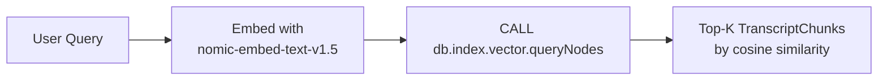

# Meetingbank Graph RAG
MeetingBank Council Intelligence — Graph RAG
A Graph RAG system for querying 1,250 U.S. city council meetings across 6 cities, built on Neo4j and deployed as a live Streamlit application. The system combines vector similarity search on transcript chunks with graph traversal for structured metadata filtering — enabling questions that flat vector search alone cannot answer reliably.

**Live Demo**->  https://meetingbank-graph-rag.streamlit.app/

## Why Graph RAG?
Flat vector search finds semantically similar chunks of text — it answers "what does this text look like?" But it has no awareness of structure: how documents relate to each other, what type of entity a chunk belongs to, or how to traverse from one entity to another.
Metadata filtering doesn't solve this. You can attach metadata to vectors (city, item type, date) and filter post-retrieval — tools like Pinecone support this. But metadata filtering is applied after the vector search, on a flat list of results. It can narrow results, but it cannot traverse relationships. The question "find all items discussed in the same meeting as this housing ordinance" cannot be expressed as a metadata filter, because the relationship between items is structural, not a property stored on any single chunk.
Graph RAG adds a knowledge graph layer where entities are nodes and their relationships are first-class citizens. This enables things flat vector search fundamentally cannot do:
- *Relationship traversal*. A chunk is connected to the item it came from, which is connected to the meeting it belongs to, which is connected to the city that hosted it. Graph RAG can traverse this path in a single query — returning not just the chunk but the full structured context of everything it's connected to.
- *Multi-hop reasoning*. Starting from a semantically retrieved chunk, a graph query can hop to sibling nodes — other agenda items in the same meeting, other meetings in the same city, or all items of a given type across the entire dataset. This kind of reasoning requires traversing relationships, which a vector index has no concept of.
- *Enrichment at query time*. Each retrieved result arrives pre-enriched with structured metadata from the graph — city, meeting date, item type, summary, source links — resolved through traversal in a single Cypher query. This is structurally cleaner than a separate metadata lookup against a secondary store.

**What this project implements?**\
This system uses two-stage Graph RAG: Stage 1 runs vector similarity search on *TranscriptChunk* nodes, Stage 2 traverses the graph from those chunks to retrieve the full structured context of each matched item (city, meeting, item type, summary, links) and applies city and item type filters during traversal. The LLM then reasons over the enriched context to synthesize an answer.

## Dataset
**MeetingBank** (Hu et al., ACL 2023) — a benchmark dataset of 1,366 city council meetings from 6 U.S. municipalities:
- Seattle
- King County
- Denver
- Boston
- Alameda
- Long Beach

This project uses *MeetingBank.json*, which contains meeting metadata, agenda items, reference summaries, and transcript segments. From this:
- **1,250 meetings** ingested
- **6,894 agenda items** as graph nodes
- **133,536 transcript chunks** embedded and stored as vectors

The MeetingBank dataset is a natural fit for this architecture. It has a well-defined entity hierarchy (City → Meeting → Item → TranscriptChunk), structured metadata (item type, duration, links), and domain-specific reference summaries that made evaluation straightforward without needing external labels.

## Graph Schema


**Node Design Decisions**
- *City*- as a node, not a Meeting property. City could have been stored as a simple string property on Meeting, but making it a node enables traversal — querying all meetings across a city, or filtering retrievals by city through the graph rather than a metadata lookup.
- *ItemType*- as a shared hub node, not an Item property. Storing item type as a string on Item would support filtering, but making it a node means all items of the same type are connected through a shared hub. This enables type-level traversal — finding all Ordinances, all Proclamations — as a graph pattern rather than a property scan.
- *summary* as a property on Item, not a node. Unlike City and ItemType, summary is not an entity worth traversing to or from. It's an attribute of the item. Promoting it to a node would add complexity with no retrieval benefit.
- Speaker nodes excluded by design. The use case is policy and topic retrieval, not speaker attribution. Speaker nodes would add traversal complexity and significantly increase the graph size without improving retrieval quality for this task.

## Architecture
**Two-Stage Retrieval Pipeline**\
*Stage 1 — Vector Search*

*Stage 2 — Graph Traversal & Filtering*
```
TranscriptChunk IDs → MATCH (chunk)<-[:HAS_CHUNK]-(item:Item)
                    → MATCH (meeting)-[:HAS_ITEM]->(item)
                    → MATCH (meeting)-[:TAKES_PLACE_IN]->(city)
                    → MATCH (item)-[:OF_TYPE]->(itemType)
                    → filter by city_name, type_name (if present)
                    → return full enriched context
```
*Stage 3 — Answer Generation*\
The enriched results (item summaries, evidence chunks, city, meeting date, links) are assembled into an LLM context and passed to **Claude Sonnet** for answer synthesis. (switched to *meta-llama/llama-4-scout-17b-16e-instruct* via Groq in Live Demo due to API key constraints for deployment)

*Entity Extraction*\
A lightweight **Claude Haiku** (switched to *llama-3.1-8b-instant* model via Groq in Live Demo) parses the user query to extract structured filters (city name, item type) before retrieval. Valid values are enumerated explicitly in the extraction prompt

## Tech Stack
| Component | Tool |
|---|---|
| Graph Database | Neo4j AuraDB |
| Embeddings | `nomic-ai/nomic-embed-text-v1.5` (768-dim, via HuggingFace SentenceTransformer) |
| Vector Index | Neo4j native vector index (cosine similarity) |
|Filter Extraction LLM | `Claude Haiku` via Anthropic API|
| Filter Extraction LLM(live demo) | `llama-3.1-8b-instant` via Groq |
| Answer Generation LLM | `Claude Sonnet` via Anthropic API |
| Answer Generation LLM (live demo) | `meta-llama/llama-4-scout-17b-16e-instruct` via Groq |
| Orchestration | LangChain |
| Text Splitting | `RecursiveCharacterTextSplitter` (LangChain) |
| Ingestion | Google Colab (T4 GPU, ~25–30 min for full dataset) |
| Demo | Streamlit Cloud |

## Ingestion Pipeline
The pipeline is resumable: embeddings are cached to a pickle file on Google Drive, so if the Colab runtime dies, it picks up from the last checkpoint rather than re-embedding everything from scratch. All writes use MERGE to prevent duplicates.

## Running Locally
**Prerequisites**
- Neo4j AuraDB instance (free tier works)
- Groq API key (free at console.groq.com)
- Anthropic API

**Setup**
```
git clone https://github.com/gayatrivlp/meetingbank-graph-rag.git
cd meetingbank-graph-rag
pip install -r requirements.txt
```
**Environment Variables**\
Set the following in your environment or a .env file:
```
NEO4J_URI=neo4j+s://<your-instance>.databases.neo4j.io
NEO4J_USERNAME=neo4j
NEO4J_PASSWORD=<your-password>
NEO4J_DATABASE=<your-database>
GROQ_KEY=<your-groq-key>
ANTHROPIC_KEY=<your-anthropic-key>
HUGGINGFACE_TOKEN=<your-huggingface-token>
```
**Run**
```
streamlit run app.py
```


